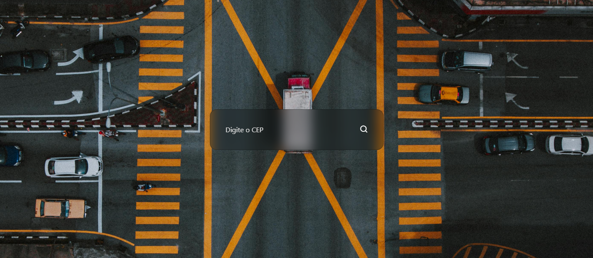

<h1 align="center"> ToDo App </h1>

Usando os conhecimentos de HTML, CSS e Javascript, fui capaz de desenvolver esse app que consulta um CEP. Atualmente sua funcionalidade é somente esse, mas futuramente pretendo adicionar um menu de "Pesquisados anteriormente".

 

  

 